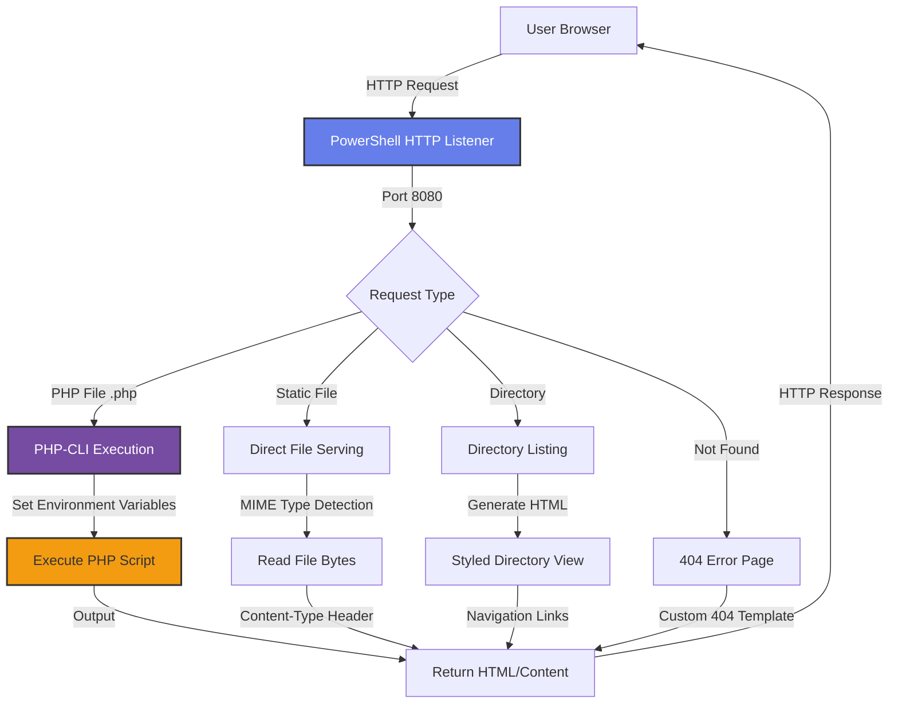
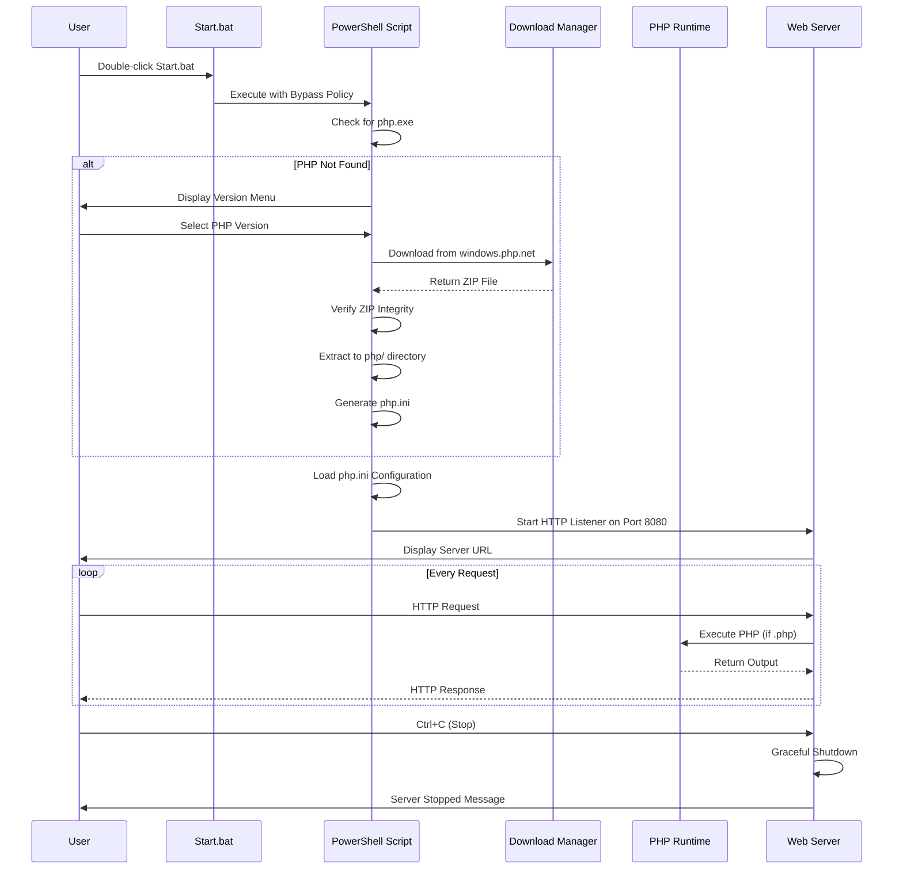

# xsukax PHP Server

<div align="center">


**A zero-configuration, standalone PHP development server for Windows with automatic PHP runtime management**

[Features](#features-and-advantages) • [Installation](#installation-instructions) • [Usage](#usage-guide) • [Security](#security-and-privacy-benefits) • [License](#licensing-information)

</div>

---

## Project Overview

**xsukax PHP Server** is a lightweight, self-contained PHP development server designed specifically for Windows environments. This single-script solution eliminates the complexity of traditional PHP server setup by automating the entire installation and configuration process. With zero external dependencies and intelligent runtime management, developers can launch a fully functional PHP server with a simple double-click.

The application automatically detects whether PHP is installed locally, downloads the appropriate PHP runtime if needed, configures essential settings, and launches an HTTP server ready to execute PHP scripts and serve static files. It supports multiple PHP versions (8.1 through 8.5), provides interactive version selection, and includes comprehensive error handling and file serving capabilities.

**Primary Use Cases:**
- Rapid PHP development environment setup for testing and prototyping
- Educational purposes and PHP learning environments
- Local development without installing XAMPP, WAMP, or similar server stacks
- Portable PHP server for presentations, demos, or client-side development
- Quick testing of PHP scripts without system-wide PHP installation

---

## Security and Privacy Benefits

### Local-First Architecture
The server operates entirely on your local machine with no external communication except for the initial PHP runtime download from official sources (windows.php.net). Once PHP is installed, the server functions completely offline, ensuring your development work remains private and isolated from external networks.

### Official PHP Distribution Sources
All PHP downloads originate exclusively from **windows.php.net**, the official PHP distribution channel for Windows. This guarantees:
- **Authentic binaries** directly from the PHP development team
- **Cryptographic integrity** through official hosting infrastructure
- **Protection against supply chain attacks** by avoiding third-party mirrors
- **Consistent versioning** with verified release checksums

### Download Verification and Integrity Checks
The application implements multiple verification layers during PHP installation:
- **File size validation** ensures downloaded archives meet minimum size requirements (>1MB)
- **ZIP integrity verification** confirms archive structure before extraction
- **Executable validation** verifies php.exe presence after extraction
- **Automatic cleanup** of corrupted or incomplete downloads

### Sandboxed Execution Environment
The server creates an isolated execution context with controlled file access:
- **Restricted document root** confines PHP execution to the designated `www/` directory
- **No system-wide modifications** — all files remain within the project folder
- **Environment variable isolation** prevents interference with system PHP installations
- **Controlled port binding** defaults to localhost (127.0.0.1) for maximum security

### Configurable php.ini Security Settings
The application automatically generates a `php.ini` configuration file with security-hardened defaults:
- **Error display disabled in production** (`display_errors = Off`)
- **Error logging enabled** for debugging without exposing sensitive information
- **File upload size restrictions** (default 128MB) to prevent resource exhaustion
- **Execution time limits** (300 seconds) to prevent runaway scripts
- **Memory limits** (256MB) to protect system resources
- **Extension control** allowing selective PHP extension activation

### No Persistence of Credentials or Sensitive Data
The server does not store, transmit, or log any user credentials, API keys, or sensitive information. All request logging is limited to HTTP method, URL path, and timestamp — no request bodies, headers with authentication tokens, or user-specific data are recorded.

### Transparent Execution Model
As an open-source PowerShell script, every line of code is inspectable and auditable. Users can verify:
- Exactly which URLs are accessed during downloads
- How PHP is configured and executed
- What data is logged or stored
- How network requests are processed

---

## Features and Advantages

### Zero-Configuration Setup
- **No installation required** — runs directly from the downloaded files
- **Automatic PHP runtime download** from official sources
- **Interactive version selection** supporting PHP 8.1, 8.2, 8.3, 8.4, and 8.5
- **Self-configuring php.ini** with sensible defaults and popular extensions pre-enabled
- **Automatic directory structure creation** for web content

### Comprehensive File Serving
- **Native PHP execution** via php-cli for dynamic content
- **Static file serving** with automatic MIME type detection
- **Directory browsing** with styled, navigable HTML listings
- **Index file prioritization** (index.php, index.html)
- **Custom 404 error pages** with professional styling

### Developer-Friendly Experience
- **Color-coded console output** for easy log monitoring
- **Real-time request logging** showing method, path, and client IP
- **Timestamp-based access logs** for debugging and analysis
- **Informative error messages** with actionable troubleshooting tips
- **Graceful shutdown handling** with proper resource cleanup

### Lightweight and Portable
- **Single PowerShell script** — no complex installation packages
- **Self-contained directory structure** easily moved or version-controlled
- **Minimal disk footprint** (PHP runtime + your project files)
- **No Windows service installation** or registry modifications
- **Quick teardown** by simply stopping the script

### Flexibility and Customization
- **Configurable port** (default: 8080, easily modified in script)
- **Customizable PHP extensions** via generated php.ini
- **Multiple PHP version support** for compatibility testing
- **Editable configuration parameters** at the top of the script
- **Custom server name** for branding or identification

---

## Installation Instructions

### Prerequisites
- **Operating System:** Windows 10, Windows 11, or Windows Server 2016+
- **PowerShell:** Version 5.1 or higher (pre-installed on modern Windows)
- **Internet Connection:** Required only for initial PHP download
- **Disk Space:** Approximately 50-100MB for PHP runtime

### Step-by-Step Installation

#### 1. Download the Repository
Clone or download this repository to your local machine:

```bash
git clone https://github.com/xsukax/xsukax-PHP-Server.git
cd xsukax-PHP-Server
```

Alternatively, download the ZIP file from the [GitHub releases page](https://github.com/xsukax/xsukax-PHP-Server/releases) and extract it to your desired location.

#### 2. Verify File Structure
Ensure the following files are present in the project directory:

```
xsukax-PHP-Server/
├── Start.bat                    # Windows batch launcher
└── xsukax_php_server.ps1       # Main PowerShell server script
```

#### 3. Optional: Review PowerShell Execution Policy
The `Start.bat` launcher automatically bypasses execution policies for this script. However, if you prefer to run the PowerShell script directly, you may need to adjust your execution policy:

```powershell
# Check current policy
Get-ExecutionPolicy

# If needed, allow script execution (run as Administrator)
Set-ExecutionPolicy -ExecutionPolicy RemoteSigned -Scope CurrentUser
```

**Note:** The batch file handles this automatically using `-ExecutionPolicy Bypass`, so manual policy changes are optional.

#### 4. First-Time Launch
Double-click **`Start.bat`** to launch the server. On first run:

1. The script will detect that PHP is not installed
2. You'll be presented with a menu of PHP versions (8.1.x, 8.2.x, 8.3.x, 8.4.x, 8.5.x)
3. Select your preferred version (or press Enter for the recommended PHP 8.3.29)
4. The script will automatically download (~30-50MB), verify, and extract PHP
5. A default `php.ini` configuration will be created
6. The server will start and display access information

#### 5. Verify Installation
After successful setup, you should see output similar to:

```
========================================================================
 xsukax PHP Server v1.0
 Standalone PHP Server for Windows
========================================================================

[+] PHP Version: 8.3.29
[+] Configuration: php\php.ini

========================================================================
 SERVER STARTED SUCCESSFULLY
========================================================================
 Server URL:    http://localhost:8080
 Document Root: C:\path\to\your\project\www
 
 Press Ctrl+C to stop the server
========================================================================
```

#### 6. Create Your Web Content
Place your PHP files and static assets in the automatically created `www/` directory:

```
xsukax-PHP-Server/
├── Start.bat
├── xsukax_php_server.ps1
├── php/                        # Auto-created PHP runtime
│   ├── php.exe
│   ├── php.ini
│   └── ...
└── www/                        # Your web content goes here
    ├── index.php
    ├── styles.css
    ├── script.js
    └── images/
```

---

## Usage Guide

### Starting the Server

**Method 1: Using the Batch Launcher (Recommended)**
```cmd
# Simply double-click Start.bat or run from command prompt
Start.bat
```

**Method 2: Direct PowerShell Execution**
```powershell
# Run from PowerShell
powershell -ExecutionPolicy Bypass -File xsukax_php_server.ps1
```

### Accessing Your Application

Once the server is running, access your PHP application through:

- **Default URL:** `http://localhost:8080`
- **Network access:** `http://YOUR_LOCAL_IP:8080` (for testing from other devices on your network)
- **Custom paths:** `http://localhost:8080/path/to/file.php`

### Common Workflows

#### Creating a Simple PHP Application

1. **Create an index file** in the `www/` directory:

```php
<?php
// www/index.php
echo "<h1>Welcome to xsukax PHP Server</h1>";
echo "<p>PHP Version: " . phpversion() . "</p>";
echo "<p>Current Time: " . date('Y-m-d H:i:s') . "</p>";
?>
```

2. **Access via browser:** Navigate to `http://localhost:8080`

#### Testing Database Connections

The server supports PHP database extensions. To enable MySQL/MariaDB support:

1. **Edit `php/php.ini`** and uncomment:
   ```ini
   extension=mysqli
   extension=pdo_mysql
   ```

2. **Restart the server** by stopping (Ctrl+C) and running `Start.bat` again

3. **Test connection:**
   ```php
   <?php
   // www/db_test.php
   $conn = new mysqli('localhost', 'user', 'password', 'database');
   if ($conn->connect_error) {
       die("Connection failed: " . $conn->connect_error);
   }
   echo "Connected successfully";
   $conn->close();
   ?>
   ```

#### Serving Static Files

Place HTML, CSS, JavaScript, images, and other static assets in `www/`:

```
www/
├── index.html
├── styles/
│   └── main.css
├── scripts/
│   └── app.js
└── images/
    └── logo.png
```

The server automatically detects MIME types and serves files appropriately.

#### Directory Browsing

If a directory doesn't contain `index.php` or `index.html`, the server generates a styled directory listing automatically. Navigate to any subdirectory to see its contents.

### php.ini Configuration

The server automatically generates `php/php.ini` with recommended settings. You can customize:

#### Memory and Resource Limits
```ini
memory_limit = 256M          ; Maximum memory per script
max_execution_time = 300     ; Maximum execution time (seconds)
upload_max_filesize = 128M   ; Maximum upload size
post_max_size = 128M         ; Maximum POST data size
```

#### Enabling Extensions
Uncomment extensions in `php.ini` as needed:
```ini
;extension=curl      → extension=curl
;extension=gd        → extension=gd
;extension=mbstring  → extension=mbstring
```

**Note:** After modifying `php.ini`, restart the server for changes to take effect.

### Server Architecture and Request Flow



### Application Lifecycle



### Troubleshooting Common Issues

#### Port Already in Use
```
[ERROR] Port 8080 is already in use or requires administrator privileges.
```
**Solution:** Edit `xsukax_php_server.ps1` and change the `$port` variable:
```powershell
$port = 8080  # Change to 8081, 8082, etc.
```

#### PHP Download Fails
```
[ERROR] Failed to download PHP. Please check your internet connection.
```
**Solution:** 
- Verify internet connectivity
- Check if your firewall/antivirus is blocking PowerShell
- Manually download from the provided URL and extract to `php/` directory

#### Permission Denied Errors
**Solution:** Run `Start.bat` as Administrator (right-click → Run as administrator)

#### PHP Extensions Not Loading
**Solution:** 
1. Check that DLL files exist in `php/ext/` directory
2. Verify correct extension syntax in `php.ini` (e.g., `extension=mysqli`)
3. Restart the server after ini changes

---

## Licensing Information

This project is licensed under the GNU General Public License v3.0.

---

## Contributing

Contributions, issues, and feature requests are welcome! Feel free to check the [issues page](https://github.com/xsukax/xsukax-PHP-Server/issues).

## Author

**xsukax**
- GitHub: [@xsukax](https://github.com/xsukax)
- Repository: [xsukax-PHP-Server](https://github.com/xsukax/xsukax-PHP-Server)

## Acknowledgments

- PHP Team for providing official Windows binaries
- PowerShell community for HTTP server implementation patterns
- Contributors and users providing feedback and bug reports

---

<div align="center">

**⭐ If you find this project useful, please consider giving it a star on GitHub! ⭐**

</div>
